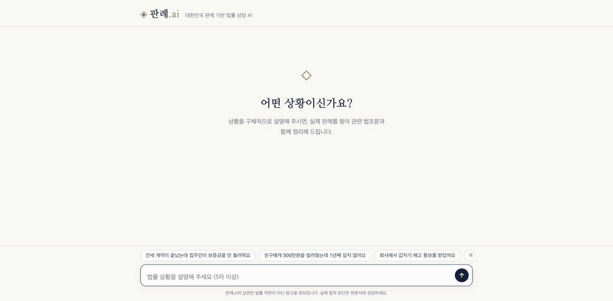
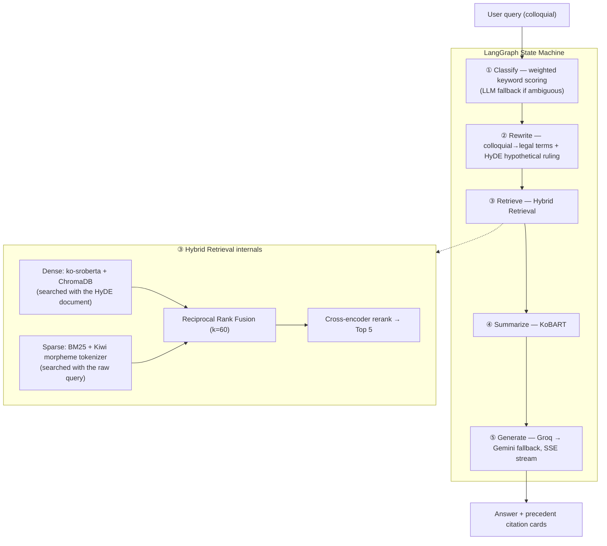

# Panrye.ai (판례.ai)

*[한국어 README](README.md)*

**A legal consultation RAG service — ask "I can't get my rental deposit back" and it answers with actual Korean Supreme Court precedents, cited by case number and statute.**

The chronic problem with legal chatbots is plausible-sounding answers that can't be verified. I took the opposite approach: **every answer must be grounded in real case law (court, ruling date, case number, cited statutes, judgment) — and hallucinated case numbers are caught as a metric, not hidden.** The entire stack, from the LLM API to deployment, runs on free tiers, which forced real design trade-offs under a hard cost constraint.



## What makes this hard

Korean legal search has a fundamental vocabulary mismatch between query and document. A user writes "돈을 안 갚아요" ("they won't pay me back"), while the ruling reads "금전소비대차계약에 기한 대여금 반환채무의 이행지체" ("default on repayment obligation under a monetary loan agreement"). A single embedding model can't bridge that gap.

So the pipeline is split into 5 stages:



The UI shows these five stages as a live stepper. While the user waits to see "what the AI is doing," each agent's progress and elapsed time is exposed directly.

## Technical decisions

**Hybrid search + RRF.** For Korean legal queries, dense-only and BM25-only retrieval both fall short. Dense catches "해고당했어요" ↔ "해고처분" (semantically related but lexically different), while exact matches like "형법 제329조" (Criminal Act Article 329) are dominated by BM25. I combined the two rankings with Reciprocal Rank Fusion instead of score interpolation, because cosine similarity and BM25 scores live on different scales, making weighted averaging unstable. RRF only looks at rank, so the only hyperparameter is k.

**HyDE only on the dense path.** Embedding a colloquial question directly puts it out of distribution relative to the ruling corpus, so an LLM first generates a "hypothetical ruling" and dense search runs against that instead. BM25, however, searches with the raw query — if HyDE-generated text leaked into keyword matching, it would corrupt exact-match retrieval.

**The decision to rebuild the corpus from scratch.** 76% of the initial corpus came from the KLAID dataset, which had no court, ruling date, or case number. In a service where "citation cards" are the whole point, unverifiable sources defeat the purpose. I discarded it entirely and re-collected data from the Korea Ministry of Government Legislation's OpenAPI, setting per-domain collection targets. Result: 5,667 cases, 100% metadata completeness, minimum domain share 10.6%.

**The decision to delete dead code.** An early version shipped with a zero-shot classifier (xlm-roberta-xnli, 2.2GB), but tracing the code path showed the keyword matcher always returned first — the zero-shot model never actually ran. I deleted it and replaced it with weighted lexicon scoring + confidence based on actual score ratios + a single LLM fallback call only when the result is ambiguous. The 2.2GB download disappeared and classification accuracy went up.

**Latency cuts came after profiling, not before.** Timing each stage showed most local compute time was in summarization, which was running 5 precedents sequentially, one at a time. Summarization and the two independent LLM calls (rewrite + HyDE) don't depend on each other, so I parallelized both, cutting the local-path latency from 8.36s to 6.37s (verified identical output). I also tried batched KoBART inference and reverted it — padding actually made it slower (10.9s vs 8.5s) and changed beam search results.

**Decoupling index deployment from code deployment.** Re-embedding 76k chunks on HF Spaces' free tier (2 vCPU) takes over 30 minutes. So the prebuilt index is uploaded to an HF Dataset, and the container downloads and SHA-256 verifies it on startup (`storage/artifacts.py`). A side benefit: index updates no longer require redeploying code. That said, there's no always-on deployed instance yet, so the actual cold-start improvement is unmeasured — the currently verified runtime environments are local and Docker.

**The free-tier stack was itself a design constraint.** If one model's quota runs out, the whole service stops — so I split models by task: 70b for generation, 8b for rewrite/classification, gpt-oss for evaluation judging. The Groq → Gemini fallback chain exists for the same reason.

## Evaluation — measure, fix, measure again

A 30-case test set (6 domains × 5) runs 4 LLM-judge metrics plus deterministic rubric checks.

| Metric | Result | Target | Verdict |
|---|---|---|---|
| Faithfulness | **0.665** | 0.80 | ❌ |
| Answer Relevancy | **0.890** | 0.75 | ✅ |
| Context Precision | **0.527** | 0.70 | ❌ |
| Context Recall | **0.450** | 0.65 | ❌ |

| Rubric (deterministic check) | Result |
|---|---|
| Domain classification accuracy | 90% |
| Statute citation rate | 100% |
| Precedent citation rate | 100% |
| Disclaimer inclusion rate | 100% |
| Hallucinated case numbers | 3 cases |

*2026-07-13 20:11:17 · 30 cases · judge=groq · avg response 17.0s (CPU) — snapshot, see [README.md](README.md) for the live-updated table*

I publish the metrics that miss target because, in this project, evaluation isn't for bragging — it's a tool for finding what to fix. The first full run had domain routing at 70%, with all 9 misclassifications collapsing into "civil." Root cause turned out to be three things: whitespace mismatches breaking keyword matching ("면허 취소" vs "면허취소"), lexicon gaps (gift tax, etc.), and the fallback LLM (8b) lacking judgment. Fixing all three brought routing to 90%, and retrieval metrics that had been collapsing under a wrong domain filter recovered along with it.

Remaining plan: a reranker score cutoff (currently always passes top-5, so irrelevant precedents dilute precision), a post-generation case number validator (masking numbers absent from context), and corpus expansion. Context Recall is structurally low partly because reference answers include procedural guidance (e.g., filing with the Ministry of Employment and Labor) that simply doesn't exist in the ruling text itself — this needs to be measured separately.

**I also rebuilt the evaluation tool itself once.** I started with RAGAS, but on the combination of a free-tier (non-OpenAI) judge and Korean output, verdict parsing broke constantly, producing 0/NaN results — and the 4-calls-per-metric structure ate into the generation quota, meaning evaluation was contaminating itself. I reimplemented it as a single-call-per-case Korean rubric judge (JSON-forced) and put the judge and the generator on different models to separate their quotas. A full 30-case run is a full day's quota budget on free tiers, so the runner has per-case checkpointing, resume, and fallback-detection retry built in.

## Data

Collected from the Korea Ministry of Government Legislation's National Law Information OpenAPI, using per-domain search keywords. The collector maintains dual case-number dedupe and a per-keyword cursor, so it can resume after interruption. Domain labeling scores: cited statute (weight 4) > Civil Act chapter context / case type name (2) > body keywords (1) — this lexicon is the same module used at both collection time and query time (`core/domains.py`), because maintaining two separate copies guarantees drift.

| Domain | Cases | Share |
|---|---|---|
| Civil | 2,119 | 37.4% |
| Criminal | 835 | 14.7% |
| Real Estate | 807 | 14.2% |
| Labor | 706 | 12.5% |
| Family Law | 600 | 10.6% |
| Administrative | 600 | 10.6% |

5,667 cases (68% Supreme Court, 1960s–2020s) · 100% completeness for court/ruling date/case number · 76,816 chunks (512 chars / 64 overlap)

## Running it

```bash
cp .env.example .env                     # GROQ_API_KEY required (free)
pip install -r requirements.txt && pip install -e .

python scripts/run_ingest.py --all       # collect cases (~1hr, needs LAW_API_KEY)
python scripts/build_index.py --fresh    # chunk + embed + BM25

uvicorn panrye.api.main:app --port 8000  # → http://localhost:8000

python -m eval.runner && python -m eval.report   # evaluate + refresh README table
pytest -q && ruff check src scripts eval tests   # 29 tests, <1s
```

Docker / HF Spaces:

```bash
docker build -t panrye . && docker run -p 7860:7860 --env-file .env panrye
```

For HF Spaces: push with the Docker SDK and set `GROQ_API_KEY`, `GOOGLE_API_KEY`, `INDEX_REPO_ID` as secrets — the container downloads the prebuilt index from the HF Dataset on startup automatically (upload via `scripts/upload_index.py`). Spaces configures itself from the YAML front matter at the top of the README (`sdk: docker`, `app_port: 7860`, etc.), so that block needs to be reinstated at deploy time.

## Structure

```
src/panrye/
├── config.py          # pydantic-settings — single source for keys, models, paths, params
├── core/domains.py    # domain lexicon (shared by collection and query time)
├── data/              # resumable collection · chunking · index build
├── agents/            # classify · rewrite (HyDE) · retrieve (RRF+rerank) · summarize · generate
├── graph/pipeline.py  # LangGraph — sync execution / stage streaming
├── api/               # FastAPI · SSE event contract (sse.py is the single source)
└── storage/           # SQLite logging · HF Dataset index deployment
static/                # vanilla JS SPA — no build tooling, no CDN
eval/                  # 30-case test set · self-hosted LLM judge · report generation
tests/                 # SSE contract, RRF math, lexicon, chunker — <1s, no model loading
```

The frontend is ~500 lines of framework-free vanilla JS. The markdown renderer is also hand-written with an escape-first whitelist approach — the shortest path that respects the no-CDN constraint while ruling out XSS by construction.

## Limitations

- The corpus is a subset of publicly available Korean case law (5,667 cases) — recent rulings and lower-court decisions may be missing
- CPU inference means 15–25s response times (embedding, reranking, and summarization all run locally) — parallelization helped, but 2 vCPU still means single-digit-to-low-double-digit seconds
- LLM answers are grounded in retrieved precedents, but do not guarantee correctness of legal interpretation

> ⚠️ This service provides AI-generated reference information based on public case law and does not substitute for professional legal advice.
