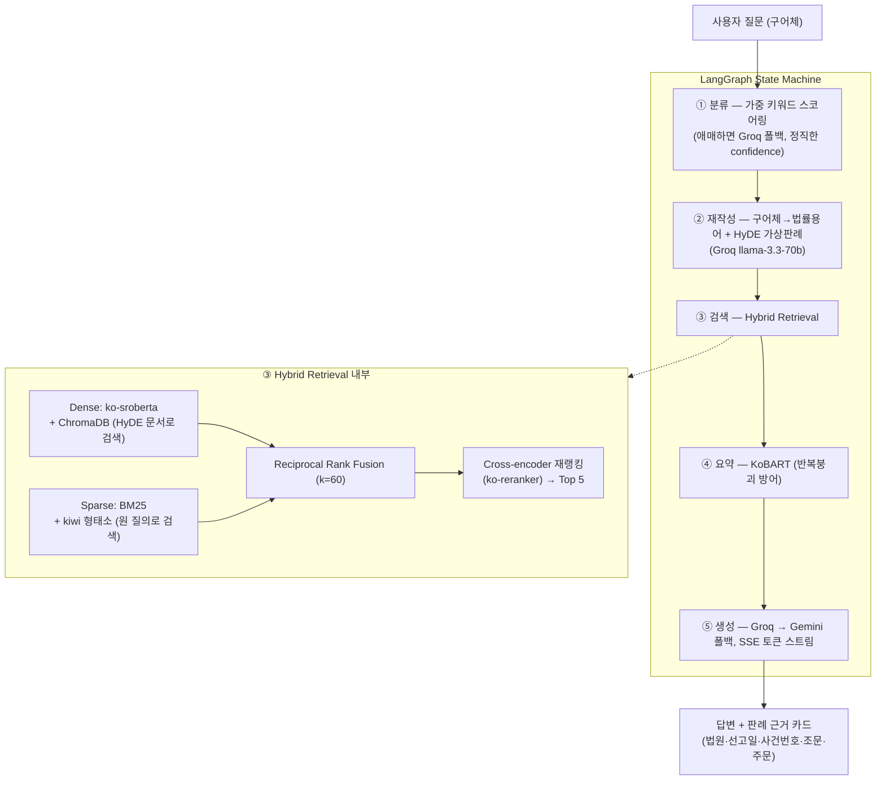

# ◈ 판례.ai — 판례 기반 법률 상담 RAG

> **상황을 설명하면, 실제 대법원 판례를 찾아 법조문과 함께 답합니다.**
> LangGraph 멀티 에이전트 · Hybrid Retrieval(Dense+BM25→RRF→Cross-encoder) · 전 구간 무료 스택

<!-- 데모 GIF: docs/demo.gif -->

한국어 법률 상담 질문은 구어체("전세금을 못 돌려받고 있어요")와 판결문 문체("임대차보증금 반환채무의 이행지체")의 어휘 격차가 크다.
판례.ai는 이 격차를 **5단계 에이전트 파이프라인**으로 메운다 — 도메인 분류 → 법률용어 재작성+HyDE → 하이브리드 검색 → 판례 요약 → 근거 인용 답변.
UI는 각 단계를 실시간 스테퍼로 보여주고, 모든 답변에 **실제 판례 카드**(법원·선고일·사건번호·참조조문·주문)를 근거로 붙인다.

## 아키텍처



각 노드는 완료 시점의 레이턴시와 함께 SSE `stage` 이벤트를 발행하고, 프런트엔드 스테퍼가 이를 실시간 시각화한다.

## 품질 지표

<!-- METRICS:START -->
*(평가 실행 후 `python -m eval.report`로 자동 주입)*
<!-- METRICS:END -->

평가: RAGAS 4메트릭(무료 저지 — Groq llama-3.3-70b + 로컬 ko-sroberta 임베딩) + 결정적 루브릭(도메인 정확도, 법조문·판례 인용률, 허위 사건번호 스캔). 테스트셋 30케이스, 6개 도메인 × 5.

## 설계 결정과 이유

| 결정 | 이유 |
|---|---|
| **Hybrid (Dense + BM25)** | 한국어 법률 검색은 형태소 불일치가 심함 — "해고당했어요"와 "해고처분"은 dense로는 가깝지만 조문 번호·사건번호 같은 정확 매칭은 BM25가 압도적. 두 랭킹을 RRF로 결합해 서로의 실패 모드를 상쇄 |
| **RRF (score interpolation 대신)** | dense 코사인과 BM25 점수는 스케일이 달라 가중 평균이 불안정. 순위 기반 결합은 하이퍼파라미터 하나(k=60)로 견고 |
| **HyDE** | 구어체 질문을 바로 임베딩하면 판결문 코퍼스와 어휘 분포가 어긋남. "가상의 판결문"을 생성해 그걸로 검색하면 문체 갭이 사라짐. 단 BM25는 원 질의로 검색(사실 키워드 보존) |
| **KLAID 폐기** | 이전 코퍼스의 76%였지만 법원·선고일·사건번호·주문이 전부 없음 → 근거 카드가 빈 껍데기가 됨. 메타데이터 완비된 법제처 OpenAPI 판례로 전량 대체 (정확도보다 **검증 가능성**을 선택) |
| **Zero-shot 분류기 삭제** | 구 버전의 xlm-roberta-xnli(2.2GB)는 키워드 매칭이 항상 먼저 반환해 실제로는 실행되지 않는 죽은 코드였음. 가중 렉시콘 스코어링 + 진짜 점수 비율 confidence + 애매할 때만 Groq 1콜로 교체 |
| **인덱스 아티팩트 분리** | 2vCPU에서 2만+ 청크 재임베딩은 30분 이상 → 프리빌드 인덱스를 HF Dataset에 올리고 시작 시 다운로드(sha256 검증). 인덱스 갱신이 코드 배포와 독립적 |
| **프레임워크 없는 SPA** | 빌드 도구·CDN 없이 vanilla JS ~500줄. 마크다운 렌더러는 escape-first 화이트리스트 자작(XSS 원천 차단) |

## 데이터

법제처 국가법령정보 OpenAPI(`open.law.go.kr`)에서 도메인별 목표 수집 (형사/민사/부동산 800 · 노동 700 · 가족법/행정 600).
수집기는 사건번호 이중 dedupe + 키워드별 커서로 **중단 후 재개** 가능. 라벨링은 참조법령(가중치 4) > 민법 편별 힌트·사건종류명(2) > 본문 키워드(1) 스코어링.

<!-- CORPUS:START -->
## 코퍼스 통계 (판례 5,667건)

법원·선고일·사건번호 완비율: 100.0%

| 도메인 | 판례 수 | 비율 |
|---|---|---|
| 민사 | 2,119 | 37.4% |
| 형사 | 835 | 14.7% |
| 부동산 | 807 | 14.2% |
| 노동 | 706 | 12.5% |
| 가족법 | 600 | 10.6% |
| 행정 | 600 | 10.6% |

| 법원 | 판례 수 |
|---|---|
| 대법원 | 3,879 |
| 서울고등법원 | 280 |
| 서울중앙지방법원 | 136 |
| 서울고법 | 106 |
| 대구고등법원 | 74 |
| 수원지방법원 | 69 |
| 서울가법 | 67 |
| 대전지방법원 | 52 |

| 연대 | 판례 수 |
|---|---|
| 0000년대 | 3 |
| 1960년대 | 57 |
| 1970년대 | 184 |
| 1980년대 | 544 |
| 1990년대 | 1,192 |
| 2000년대 | 1,192 |
| 2010년대 | 1,204 |
| 2020년대 | 1,291 |

| 도메인 | 청크 수 | 비율 |  (총 76,816개)
|---|---|---|
| 민사 | 37,953 | 49.4% |
| 노동 | 9,878 | 12.9% |
| 부동산 | 9,571 | 12.5% |
| 형사 | 8,074 | 10.5% |
| 가족법 | 6,256 | 8.1% |
| 행정 | 5,084 | 6.6% |
<!-- CORPUS:END -->

## 실행

```bash
# 0. 설정
cp .env.example .env   # GROQ_API_KEY 필수

# 1. 의존성 (Python 3.10+)
pip install -r requirements.txt && pip install -e .

# 2. 데이터 파이프라인 (LAW_API_KEY 필요, ~1시간)
python scripts/run_ingest.py --all
python scripts/build_index.py --fresh

# 3. 서버
uvicorn panrye.api.main:app --port 8000
# → http://localhost:8000

# 4. 평가 / 테스트
python -m eval.runner && python -m eval.report
pytest -q && ruff check src scripts eval tests
```

### Docker / HF Spaces

```bash
docker build -t panrye .
docker run -p 7860:7860 --env-file .env panrye
```

Spaces 배포: 이 repo를 Docker SDK Space로 푸시하고 `GROQ_API_KEY`(필수), `GOOGLE_API_KEY`, `INDEX_REPO_ID`를 Space secrets로 설정.
인덱스는 `INDEX_REPO_ID=<user>/panrye-index` 데이터셋에서 시작 시 자동 부트스트랩 (`scripts/upload_index.py`로 업로드).

## 프로젝트 구조

```
src/panrye/
├── config.py        # pydantic-settings — 키·모델·경로·파라미터 단일 소스
├── core/            # domains.py (가중 렉시콘, 수집·질의 공용) · types.py
├── data/            # ingest(재개 가능 수집) · chunker(512/64+메타헤더) · index_build
├── agents/          # classifier · reformulator(HyDE) · retriever(RRF+rerank)
│                    # summarizer(KoBART) · generator(Groq→Gemini)
├── graph/pipeline.py  # LangGraph — run_pipeline / stream_retrieval(StageEvent)
├── api/             # main(FastAPI) · sse.py(이벤트 계약 단일 소스) · schemas
└── storage/         # db.py(SQLite 로깅) · artifacts.py(HF Dataset 인덱스 배포)
static/              # vanilla SPA (index.html · app.css · app.js)
eval/                # testset(30) · runner(RAGAS+루브릭) · report(README 자동 주입)
tests/               # 29 tests, <1s, 모델 다운로드 없음
```

## 한계

- 판례 코퍼스는 법제처 공개 판례 일부(5,667건)로, 최신 판례나 하급심 판결이 누락될 수 있음
- CPU 추론 기준 응답 15~25초 (임베딩·리랭킹·요약 모두 로컬 모델)
- LLM 답변은 검색된 판례에 근거하지만 법리 해석의 정확성을 보장하지 않음

> ⚠️ **면책 고지**: 본 서비스는 AI가 공개 판례를 기반으로 생성한 참고 정보를 제공하며, 정식 법률 자문을 대체하지 않습니다.
