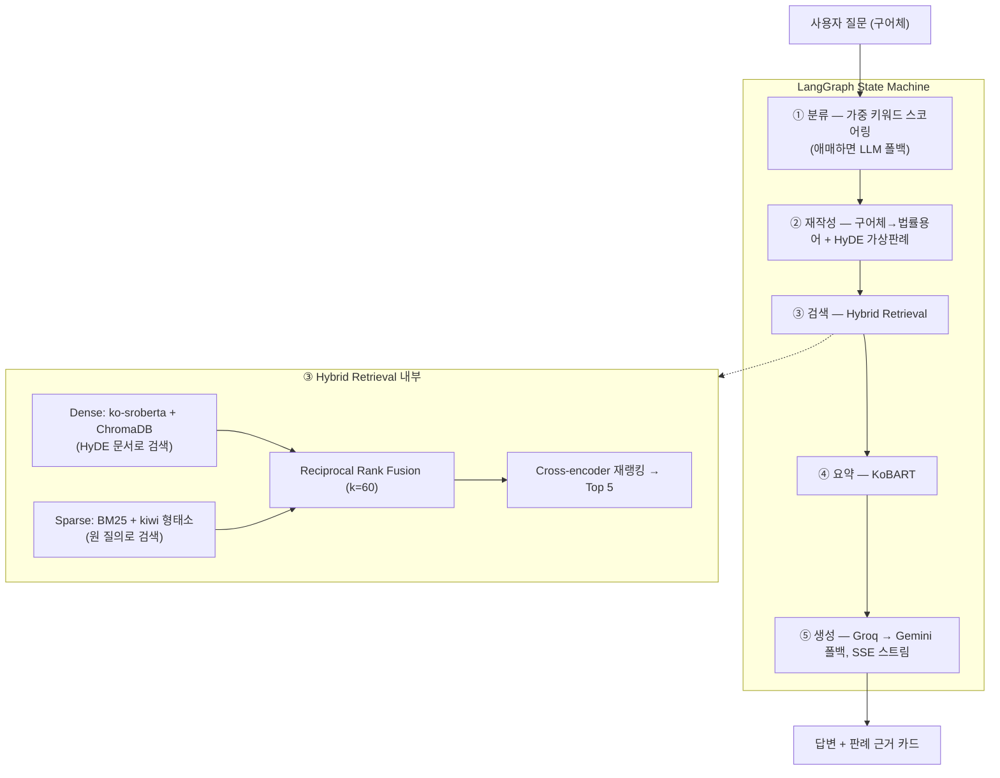

# 판례.ai

*[English README](README.en.md)*

**"전세금을 못 돌려받고 있어요"라고 물으면, 실제 대법원 판례를 찾아 사건번호와 법조문을 근거로 답하는 법률 상담 RAG 서비스입니다.**

법률 상담 챗봇의 고질병은 그럴듯하지만 검증할 수 없는 답변입니다. 저는 반대로 접근했습니다 — **모든 답변이 실제 판례(법원·선고일·사건번호·참조조문·주문)를 근거로 제시하고, 근거 없는 사건번호는 지표로 잡아내는** 시스템을 목표로 잡았습니다. LLM API부터 배포까지 전 구간을 무료 스택으로 구성해서, 비용 제약 아래에서의 설계 트레이드오프도 함께 다뤘습니다.


## 무엇이 어려운 문제인가

한국어 법률 검색은 질문과 문서의 어휘가 근본적으로 어긋납니다. 사용자는 "돈을 안 갚아요"라고 쓰고, 판결문은 "금전소비대차계약에 기한 대여금 반환채무의 이행지체"라고 씁니다. 임베딩 하나로는 이 갭을 못 넘습니다.

그래서 파이프라인을 5단계로 쪼갰습니다:



UI는 이 다섯 단계를 실시간 스테퍼로 보여줍니다. 사용자가 "AI가 뭘 하고 있는지" 기다리는 동안 각 에이전트의 진행 상황과 소요 시간이 그대로 드러납니다.

## 기술적 의사결정

**Hybrid 검색 + RRF.** 한국어 법률 질의는 dense만으로도, BM25만으로도 부족합니다. "해고당했어요"↔"해고처분"은 dense가 잡지만, "형법 제329조" 같은 정확 매칭은 BM25가 압도적입니다. 두 랭킹을 점수 보간 대신 Reciprocal Rank Fusion으로 결합했는데, 코사인 유사도와 BM25 점수는 스케일이 달라 가중 평균이 불안정하기 때문입니다. RRF는 순위만 보므로 하이퍼파라미터가 k 하나로 끝납니다.

**HyDE는 dense에만.** 구어체 질문을 바로 임베딩하면 판결문 코퍼스와 분포가 어긋나므로, LLM이 생성한 "가상의 판결문"으로 dense 검색을 합니다. 단 BM25는 원 질의로 검색합니다 — HyDE가 지어낸 텍스트가 키워드 매칭을 오염시키면 안 되니까요.

**데이터를 갈아엎은 결정.** 초기 코퍼스의 76%는 KLAID 데이터셋이었는데, 법원·선고일·사건번호가 전부 없었습니다. "근거 카드"가 핵심인 서비스에서 근거의 출처를 확인할 수 없다면 의미가 없다고 판단해 전량 폐기하고, 법제처 OpenAPI에서 도메인별 목표치를 정해 재수집했습니다. 결과: 판례 5,667건, 메타데이터 완비율 100%, 최소 도메인 비중 10.6%.

**죽은 코드를 지운 결정.** 초기 버전에는 zero-shot 분류기(xlm-roberta-xnli, 2.2GB)가 있었지만, 추적해 보니 키워드 매칭이 항상 먼저 반환해서 실제로는 한 번도 실행되지 않는 코드였습니다. 과감히 삭제하고 가중 렉시콘 스코어링 + 실제 점수 비율 기반 confidence + 애매할 때만 LLM 1콜로 교체했습니다. 모델 다운로드 2.2GB가 사라졌고 분류 정확도는 오히려 올랐습니다.

**레이턴시는 재고 나서 잘랐습니다.** 단계별로 시간을 재보니 로컬 연산의 대부분이 요약인데 판례 5건을 한 건씩 순차로 돌리고 있었습니다. 요약도, 재작성+HyDE 두 LLM 콜도 서로 독립이라 병렬로 바꿔 로컬 경로를 8.36s → 6.37s로 줄였습니다(출력 동일 확인). 반면 KoBART 배치 추론은 시도했다가 되돌렸습니다 — 패딩 때문에 오히려 느렸고(10.9s vs 8.5s) 빔서치 결과까지 달라졌습니다.

**인덱스와 코드의 배포 분리.** HF Spaces 무료 티어(2vCPU)에서 7.6만 청크를 재임베딩하면 30분 넘게 걸립니다. 그래서 프리빌드 인덱스를 HF Dataset에 올려두고 컨테이너가 시작할 때 내려받아 sha256으로 검증하도록 구성했습니다(`storage/artifacts.py`). 인덱스 갱신이 코드 배포와 독립적이라는 부수 효과도 있습니다. 다만 상시 배포한 인스턴스가 아직 없어서 콜드스타트가 실제로 얼마나 줄었는지는 측정하지 못했습니다 — 현재 검증된 실행 환경은 로컬과 Docker입니다.

**무료 스택은 그 자체가 설계 제약이었습니다.** 한 모델의 쿼터가 마르면 서비스 전체가 멈추므로 태스크별로 모델을 갈라 놨습니다 — 생성 70b, 재작성·분류 8b, 평가 저지 gpt-oss. Groq이 죽으면 Gemini로 넘어가는 폴백 체인도 같은 이유입니다.

## 평가 — 측정하고, 고치고, 다시 측정

30케이스(6개 도메인 × 5) 테스트셋으로 LLM 저지 4메트릭 + 결정적 루브릭을 돌립니다.

<!-- METRICS:START -->
| 메트릭 | 결과 | 목표 | 판정 |
|---|---|---|---|
| Faithfulness | **0.665** | 0.80 | ❌ |
| Answer Relevancy | **0.890** | 0.75 | ✅ |
| Context Precision | **0.527** | 0.70 | ❌ |
| Context Recall | **0.450** | 0.65 | ❌ |

| 루브릭 (결정적 체크) | 결과 |
|---|---|
| 도메인 분류 정확도 | 90% |
| 법조문 인용률 | 100% |
| 판례 인용률 | 100% |
| 면책 고지 포함률 | 100% |
| 허위 사건번호 | 3건 |

*2026-07-13 20:11:17 · 30케이스 · judge=groq · 평균 응답 17.0s (CPU)*
<!-- METRICS:END -->

미달 지표를 그대로 공개하는 이유는, 이 프로젝트에서 평가의 역할이 "점수 자랑"이 아니라 **개선 지점을 찾는 도구**이기 때문입니다. 실제로 첫 풀런에서 도메인 라우팅이 70%였고, 오분류 9건이 전부 "민사"로 쏠리는 패턴을 발견했습니다. 원인을 파보니 세 가지였습니다 — 공백 표기 차이로 키워드 매칭 실패("면허 취소" vs "면허취소"), 렉시콘 구멍(증여·세금 등), 폴백 LLM의 판단력 부족(8b). 셋을 고치자 라우팅이 90%로 올랐고, 잘못된 도메인 필터로 붕괴하던 검색 지표도 함께 회복됐습니다.

남은 개선 계획: 리랭커 점수 컷오프(현재 무조건 top-5 전달 → 무관 판례 혼입이 precision을 깎음), 생성 후 사건번호 검증기(컨텍스트에 없는 번호 마스킹), 코퍼스 확장. Context Recall은 모범답안 속 절차 안내(노동청 진정 등)가 판례 본문에 원래 없어서 구조적으로 낮게 나오는 문제가 섞여 있어 분리 측정이 필요합니다.

**평가 도구 자체도 한 번 갈아엎었습니다.** 처음엔 RAGAS를 썼는데, 무료 티어(비OpenAI) 저지 + 한국어 답변 조합에서 verdict 파싱이 수시로 깨져 0/NaN이 나왔고, 메트릭당 4콜씩 나가는 구조가 생성용 쿼터까지 잠식해 평가가 자기 자신을 오염시켰습니다. 케이스당 1콜짜리 한국어 루브릭 저지(JSON 강제)로 재구현하고, 저지와 생성을 다른 모델에 배치해 쿼터를 분리했습니다. 무료 쿼터 안에서 30케이스 평가가 하루 예산이라, 러너에는 케이스별 체크포인트와 재개, 폴백 감지 재시도를 넣었습니다.

## 데이터

법제처 국가법령정보 OpenAPI에서 도메인별 검색 키워드로 수집합니다. 수집기는 사건번호 이중 dedupe와 키워드별 커서를 유지해 중단 후 이어서 수집할 수 있습니다. 도메인 라벨링은 참조법령(가중 4) > 민법 편별 문맥·사건종류명(2) > 본문 키워드(1) 스코어링 — 이 렉시콘은 수집 시점과 질의 시점이 같은 모듈(`core/domains.py`)을 씁니다. 두 벌로 관리하면 반드시 어긋나기 때문입니다.

<!-- CORPUS:START -->
| 도메인 | 판례 수 | 비율 |
|---|---|---|
| 민사 | 2,119 | 37.4% |
| 형사 | 835 | 14.7% |
| 부동산 | 807 | 14.2% |
| 노동 | 706 | 12.5% |
| 가족법 | 600 | 10.6% |
| 행정 | 600 | 10.6% |

판례 5,667건 (대법원 68%, 1960~2020년대) · 법원·선고일·사건번호 완비율 100% · 청크 76,816개 (512자/64 오버랩)
<!-- CORPUS:END -->

## 실행

```bash
cp .env.example .env                     # GROQ_API_KEY 필수 (무료)
pip install -r requirements.txt && pip install -e .

python scripts/run_ingest.py --all       # 판례 수집 (~1시간, LAW_API_KEY 필요)
python scripts/build_index.py --fresh    # 청킹 + 임베딩 + BM25

uvicorn panrye.api.main:app --port 8000  # → http://localhost:8000

python -m eval.runner && python -m eval.report   # 평가 + README 표 갱신
pytest -q && ruff check src scripts eval tests   # 테스트 29개, <1s
```

Docker / HF Spaces:

```bash
docker build -t panrye . && docker run -p 7860:7860 --env-file .env panrye
```

HF Spaces에 올릴 경우: Docker SDK로 푸시하고 `GROQ_API_KEY`, `GOOGLE_API_KEY`, `INDEX_REPO_ID`를 secrets로 넣으면 시작 시 인덱스를 HF Dataset에서 자동으로 내려받습니다(업로드는 `scripts/upload_index.py`). Spaces는 README 최상단의 YAML front matter(`sdk: docker`, `app_port: 7860` 등)로 Space를 구성하므로, 배포 시점에 그 블록을 다시 넣어야 합니다.

## 구조

```
src/panrye/
├── config.py          # pydantic-settings — 키·모델·경로·파라미터 단일 소스
├── core/domains.py    # 도메인 렉시콘 (수집·질의 공용)
├── data/              # 재개 가능 수집 · 청킹 · 인덱스 빌드
├── agents/            # 분류 · 재작성(HyDE) · 검색(RRF+rerank) · 요약 · 생성
├── graph/pipeline.py  # LangGraph — 동기 실행 / 스테이지 스트리밍
├── api/               # FastAPI · SSE 이벤트 계약(sse.py가 단일 소스)
└── storage/           # SQLite 로깅 · HF Dataset 인덱스 배포
static/                # vanilla JS SPA — 빌드 도구·CDN 없음
eval/                  # 30케이스 테스트셋 · 자체 LLM 저지 · 리포트 생성
tests/                 # SSE 계약·RRF 수식·렉시콘·청커 — 모델 로딩 없이 <1s
```

프런트엔드는 프레임워크 없이 vanilla JS ~500줄입니다. 마크다운 렌더러도 escape-first 화이트리스트 방식으로 직접 썼습니다 — CDN 금지 제약을 지키면서 XSS 걱정을 원천 차단하는 가장 짧은 경로였습니다.

## 한계

- 코퍼스는 법제처 공개 판례 일부(5,667건) — 최신·하급심 판결 누락 가능
- CPU 추론 기준 응답 15~25초 (임베딩·리랭킹·요약 전부 로컬 모델) — 병렬화로 줄였지만 2vCPU에서는 여전히 초 단위
- LLM 답변은 검색된 판례에 근거하지만 법리 해석의 정확성을 보장하지 않음

> ⚠️ 본 서비스는 AI가 공개 판례를 기반으로 생성한 참고 정보를 제공하며, 정식 법률 자문을 대체하지 않습니다.
